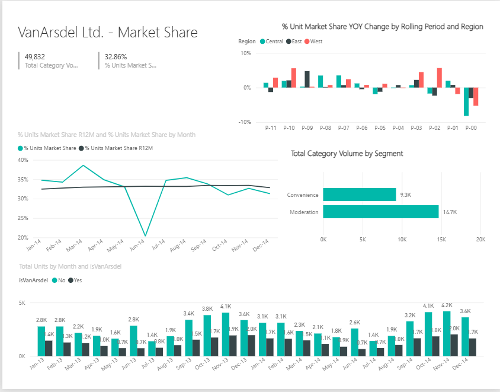
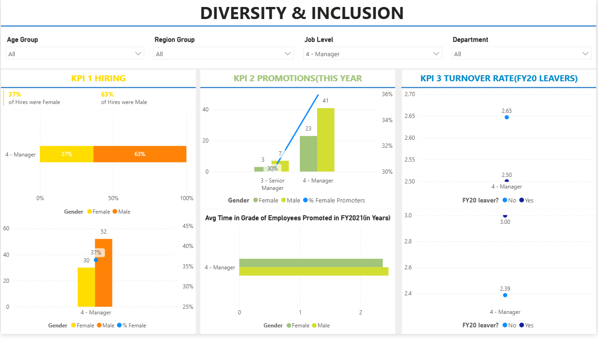

  
<p align="center"> 
  
</p>  
  
 
<h1 align="center">Power BI Dashboards</h1> 

<p align="center">
Interactive dashboards showcasing Business Intelligence, Data Visualization, KPI Reporting, and Data Analytics.
</p>

---

## About

This repository contains a collection of Power BI dashboards developed to demonstrate business intelligence, data visualization, and analytical reporting skills using real-world datasets.

---

## Dashboard Gallery

### Weather Analytics Dashboard


Interactive weather analytics dashboard featuring temperature trends, rainfall analysis, humidity, wind speed, UV index, and weather distribution.
 
--- 

### Sales & Marketing Dashboard



Business intelligence dashboard providing market share analysis, sales performance, category insights, and year-over-year trends.

---

### HR Diversity & Inclusion Dashboard



HR analytics dashboard focused on workforce diversity, promotions, hiring metrics, and employee turnover analysis.

---

## Skills Demonstrated

- Data Cleaning
- Data Modeling
- Power Query
- DAX
- KPI Reporting
- Interactive Dashboards
- Data Visualization
- Business Intelligence

---

## Tools & Technologies

| Category | Technologies |
|----------|--------------|
| Visualization | Power BI |
| Data Transformation | Power Query |
| Data Modeling | DAX |
| Data Source | Microsoft Excel |
| Version Control | Git, GitHub |

---

## Repository Contents

```
PowerBI-Dashboards/
│
├── assets/
│   ├── banner.png
│   ├── weather-dashboard.png
│   ├── sales-dashboard.png
│   └── hr-dashboard.png
│
├── Weather Analytics Dashboard.pbix
├── Sales & Marketing Dashboard.pbix
├── HR Diversity & Inclusion Dashboard.pbix
│
├── README.md
├── LICENSE
└── .gitignore
```

---

## Getting Started

1. Download the required `.pbix` file.
2. Open it using **Power BI Desktop**.
3. Explore the interactive reports and visualizations.

---

## Author

**Anuj Shinde**

B.Tech Computer Science & Engineering (2026)

Portfolio: https://anuj-shinde.netlify.app

LinkedIn: https://www.linkedin.com/in/anuj-shinde-b78378274

Email: anujshinde000@gmail.com

---

## License

This project is licensed under the MIT License.

---

<p align="center">
<i>Designed for learning, portfolio demonstration, and business intelligence practice.</i>
</p>
